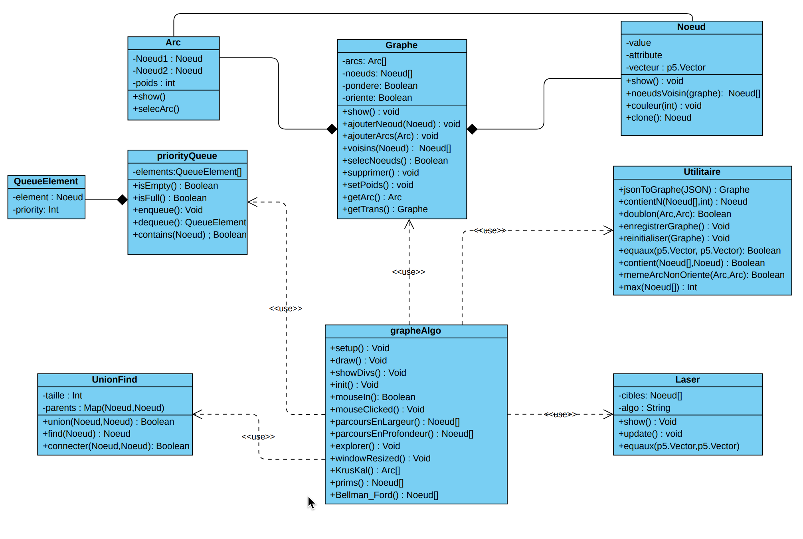

# AlgoSoupe

## Digramme de classe :

### Role de chaque classe :

    * Arc : represente l'arc d'un graphe, il est composé de deux noeuds
    * Noeud : represente le noeud d'un graphe, chaque neoud a un attribut vecteur pour la position, select pour savoir s'il est selectionné et value pour sa valeur
    * Graphe : represente le graphe lui-meme avec un tableau de noeuds et un autre d'arcs, un attribut pondere pour savoir s'il est pondéré et oriente pour savoir s'il est orienté.

    * graphesAlgo : est le code qui permet de dessiner le graphe et executer des algorithmes.

    * Circular.js : permet de convertir une instance de classe en JSON tout en supprimant les dependances circulaire, il est utilisé pour enregistrer le graphe dans le naviguateur de l'utilisateur ( LocalStorage ).

## Diagramme de cas d'utilisation :

## Hierarchie du projet :

Un fichier par type d'algorithme est la logique de notre arborescence, les algo
de tris sont dans AlgoTris, pour chaque algortihme nous avons **un fichier html** pour le canvas du p5.js( en général index.html ), et **un fichier JavaScript** pour le code l'animation.
Le code HTML des pages principales du site sont dans : web.html(pour la page d'acceuil), Algo.html (pour la page de visualisation des algorithmes ) et graphe.html (pour le dessin et algorithmes du graphe).
