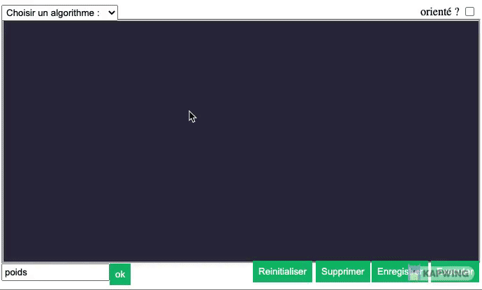
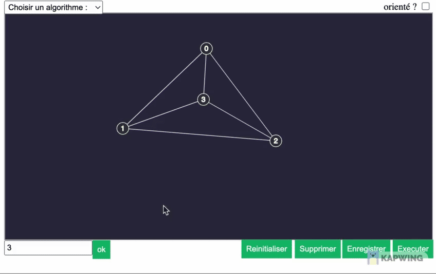
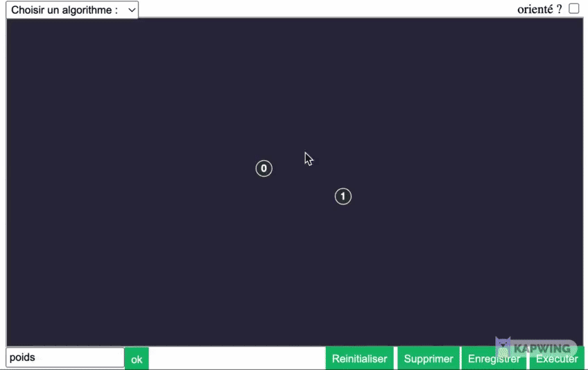
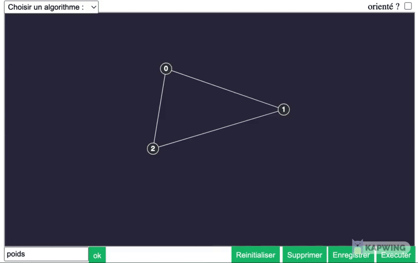

;

# AlgoSoupe

## Sommaire

1. [Introduction](#Introduction)
2. [Video de présentation](#video-de-présentation)
3. [Technologies](#technologies)
4. [Installation](#installation)
5. [Utilisation](#Utilisation)
6. [Fonctionalités à ajouter](#Auteurs)
7. [Auteurs](#Utilisation)

## Introduction

---

Nous avons choisi de faire ce projet dans le but d'aider les futurs étudiants de la L3 informatique à mieux comprendre les algorithmes vus lors de nos modules.
AlgoSoupe contient des visualisations des algorithmes utilisés dans les modules MAG (algorithmiques des graphes) et ALG2 (algorithmique) enseignés en troisième année à l'ISTIC. Il contient aussi une page sur laquelle on peut dessiner un graphe et appliquer des algorithmes sur ce dernier. L'exécution de l'algorithme sera détaillée pas à pas sur le graphe dessiné par l'utilisateur. Par ailleurs, on peut récupérer le graphe sous la forme d'une image png..

## Video de présentation

https://www.youtube.com/watch?v=gMZz6K70meg

## Technologies

---

- #### JavaScript
- #### p5.js
- #### Html
- #### Css
- #### circular.js

## Installation

---

On peut acceder au projet de la manière suivante :

```
$ git clone https://gitlab.istic.univ-rennes1.fr/haissa/algosoupe.git ou telecharger directement le projet  
On peut commencer à utiliser AlgoSoupe en ouvarant   l'un des pages du site (web.html,Algo.html ou graphe.html) dans un naviguateur.


```

## Utilisation

### Pour le dessin du graphe : on va tout d'abord sur la page graphe du site:


- #### on appuit une fois pour ajouter un noeud.
  
- #### on peut clicker sur un noeud pour le selectionner, clicker sur le boutton supprimer pour le supprimer. En supprimant un noeud on supprime aussi tous les arcs liés à ce neoud.
  
- #### une fois un noeud selectionner on peut selectionner un autre noeud pour créer un arc entre les deux.
  
- #### On peut selectionner un arc soit pour le supprimer soit pour ajouter un poids, une fois qu'on ajoute un poids à un arc le graphe sera considéré comme étant pondéré et tous les autres arcs auront la valeur zero comme poids.
  
- #### On peut selectionner plusieurs arcs et leurs attribués le meme poids
  

## Fonctionalités à ajouter :

### Partie graphe :

- Ajouter le reste des algorithmes du cours.
- Ajouter la selection des arcs retours dans un graphe orienté.

### Partie algorithmes :

- Ajouter le reste des algorithmes du cours.

### Général :

- Adapter le site pour tout type de résolution d'écran.

## Auteurs :

Issa Hassan Fadoul : hassan-fadoul.issa@etudiant.univ-rennes1.fr
Guermouche Asma : asma.guermouche@etudiant.univ-rennes1.fr
Aiman Aouad : aiman.aouad@etudiant.univ-rennes1.fr
Gulizar Agayeva : gulizar.agayeva@etudiant.univ-rennes1.fr
