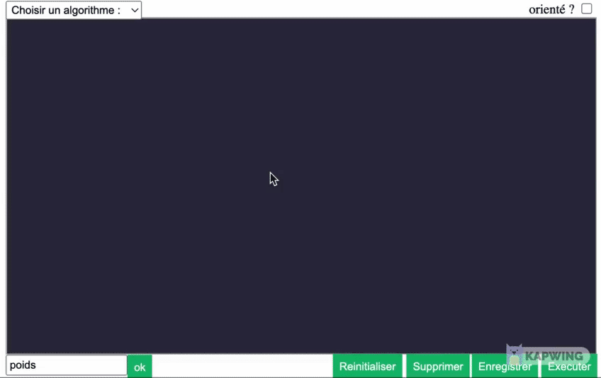

;

# AlgoSoupe

## Table of Contents

1. [information general](#general-info)
2. [Technologies](#technologies)
3. [Installation](#installation)
4. [Utilisation](#Utilisation)
5. [Collaboration](#collaboration)
6. [FAQs](#faqs)

### General Info

---

Nous avons choisit de faire ce projet dans le but d'aider les étudiant à mieu comprendre les algorithmes

### Screenshot


## Technologies

---

A list of technologies used within the project:

- [JavaScript](https://example.com): Version 12.3
- [Html](https://example.com): Version 2.34
- [Css](https://example.com): Version 1234
- [p5.js](https://example.com): Version 1234
- [circular.js](https://example.com): Version 1234

## Installation

---

A little intro about the installation.

```
$ git clone https://example.com
$ cd ../path/to/the/file
$ npm install
$ npm start
```

Side information: To use the application in a special environment use `lorem ipsum` to start

## Utilisation

Pour le dessin du graphe : on va tout d'abord sur la page graphe du site:


- on appuit une fois pour ajouter un noeud.
  
- on peut clicker sur un noeud pour le selectionner, clicker sur le boutton supprimer pour le supprimer. En supprimant un noeud on supprime aussi tous les arcs liés à ce neoud.
  
  
- une fois un noeud selectionner on peut selectionner un autre noeud pour créer un arc entre les deux.
  
- On peut selectionner un arc soit pour le supprimer soit pour ajouter un poids, une fois qu'on ajoute un poids à un arc le graphe sera considéré comme étant pondéré et tous les autres arcs auront la valeur zero comme poids.
  
- On peut selectionner plusieurs arcs et leurs attribués le meme poids
  

## Collaboration

---

Give instructions on how to collaborate with your project.

> Maybe you want to write a quote in this part.
> Should it encompass several lines?
> This is how you do it.

## FAQs

---

A list of frequently asked questions

1. **This is a question in bold**
   Answer to the first question with _italic words_.
2. **Second question in bold**
   To answer this question, we use an unordered list:

- First point
- Second Point
- Third point

3. **Third question in bold**
   Answer to the third question with _italic words_.
4. **Fourth question in bold**
   | Headline 1 in the tablehead | Headline 2 in the tablehead | Headline 3 in the tablehead |
   |:--------------|:-------------:|--------------:|
   | text-align left | text-align center | text-align right |
