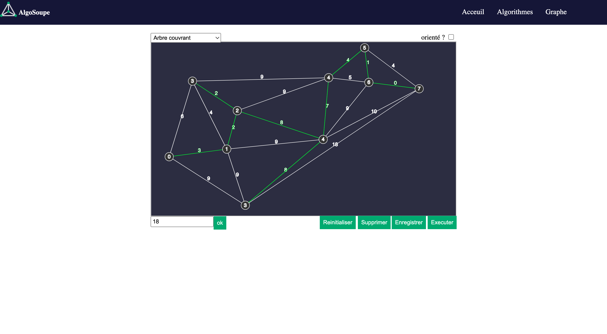

;

# AlgoSoupe

## Table of Contents

1. [information generale](#general-info)
2. [Technologies](#technologies)
3. [Installation](#installation)
4. [Utilisation](#Utilisation)

### information generale

---

Nous avons choisit de faire ce projet dans le but d'aider les étudiant à mieux comprendre les algorithmes.
AlgoSoupe contient des visualisations des algorithmes utilisés dans les modules MAG(algorithmiques des graphes) et ALG2 (algorithimique) enseignés en troisième année à l'istic. Il contient aussi une page sur laquelle on peut dessiner un graphe et appliquer des algorithmes sur ce dernier.
L'execution de l'algorithme sera detaillé pas à pas sur le graphe dessiné par l'utilisateur.
On peut aussi recuperer le graphe sous forme d'une image png.

## Technologies

---

- #### JavaScript
- #### p5.js
- #### Html
- #### Css
- #### circular.js

## Installation

---

On peut acceder au projet de la manière suivante :

```
$ git clone https://gitlab.istic.univ-rennes1.fr/haissa/algosoupe.git ou telecharger directement le projet  
On peut commencer à utiliser AlgoSoupe en ouvarant   l'un des pages du site (web.html,Algo.html ou graphe.html) dans un naviguateur.


```

## Utilisation

### Pour le dessin du graphe : on va tout d'abord sur la page graphe du site:



- #### on appuit une fois pour ajouter un noeud.
  
- #### on peut clicker sur un noeud pour le selectionner, clicker sur le boutton supprimer pour le supprimer. En supprimant un noeud on supprime aussi tous les arcs liés à ce neoud.
  
- #### une fois un noeud selectionner on peut selectionner un autre noeud pour créer un arc entre les deux.
  
- #### On peut selectionner un arc soit pour le supprimer soit pour ajouter un poids, une fois qu'on ajoute un poids à un arc le graphe sera considéré comme étant pondéré et tous les autres arcs auront la valeur zero comme poids.
  
- #### On peut selectionner plusieurs arcs et leurs attribués le meme poids
  
